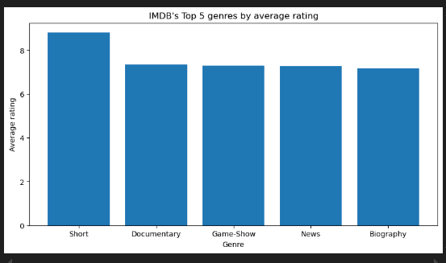
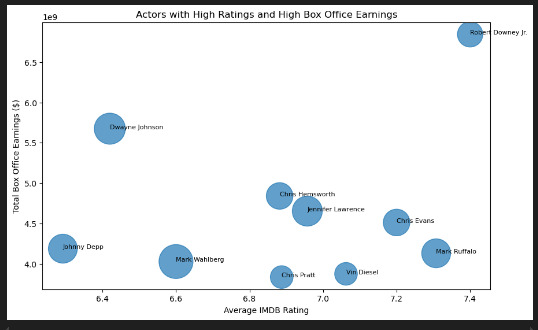
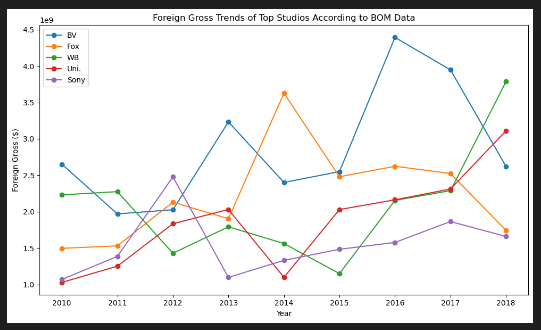
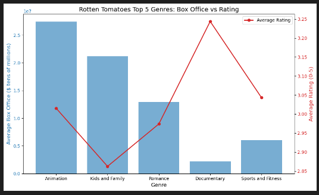

<h1 align='center'>
GENERIC NAME LTD MOVIE ANALYSIS
</h1>

> **Authors**: Group 5

<h2 align='center'>
OVERVIEW
</h2>

* Generic Name LTD is looking to expand into the movie business
* The data analysis division has conducted a study on the best practices this new movie division should follow.
* We used data from reputable movie ranking websites to identify good practices that could give our studio an edge.
* These practices, if implemented, could not only result in high returns but also critical acclaim at the box office.
* Our findings include best genre (animation), average length of most blockbuster movies (~ 120mins) and best studio to collaborate with (BV).
* We also include recommendations on optimal release times for various genres of movies.

<h2 align='center'>
BUSINESS PROBLEM
</h2>

* The movie studio business is filled with great, good and bad movies.
* This study aims to figure out how our studio can make great movies
* This is done by looking at which movies perform best in the box office
* Which movies have a high ROI and warrant sequels
* Which actors generate hype around a film and result in more revenue.

<h2 align='center'>
DATA
</h2>

* Used data from IMDB, RT and BOM
* Reputable movie studios
* Contained info on movie ratings, box office, actors and directors
* Used Python, Pandas, SQL and Numpy
* Lacked information on theaters
* Data was well-structured but needed cleaning
* After cleaning, analysis followed.

<h2 align='center'>
METHODS
</h2>

* Done using Pandas and Matplolib
* Revealed insights on genre, actors, directors, studios
* Revealed international market leaders like Buena Vista, Warner Bros and Sony
* Some A-List actors identified
* Analysis revealed trends such as romantic movies being the most profitable movies in Feb

<h2 align='center'>
RESULTS
</h2>

<h3>
Top 5 genres by average rating
</h3>

<h3>
Actors with high ratings and high box office revenues
</h3>

<h3>
Foreign Gross Trends by Studio
</h3>

<h3>
Top 5 genres: Box Office vs Rating
</h3>

<h2 align='center'>
CONCLUSIONS
</h2>

* Best Genre: Animation
* Average runtime: 104 minutes
* Top Directors: Omer Pasha
* International Market Leaders: Buena Vista (BV)
* Best Release Month: February

<h2 align='center'>
RECOMMENDATIONS
</h2>

* Prioritize Animation
* Benchmark top studios
* Optimize release schedule
* Target runtime
* Pursue strategic distribution patnerships
* Optimize the ‘January slump’
* Use short films as a talent incubator
* Content localization for global markets

<h2 align='center'>
NEXT STEPS
</h2>

* Initiate ‘Big 5' talks
* Budget for the $30M benchmark
* Set the release calendar
* Commission an animation script
* Secure franchise rights
* Automate the data pipeline
* Implement audience testing
* Evaluate independent animation studios for acquisition.
* Greenlight a short-film pilot

<h2 align='center'>
FOR MORE INFORMATION
</h2>

For more information visit the [Jupyter Notebook](./notebook.ipynb), [Tableau Dashboard](https://public.tableau.com/app/profile/andrew.nyakiba/viz/tableauproject_17701956125930/BlockbustervsCriticsChoice?publish=yes) or [Presentation](./presentation.pdf)
